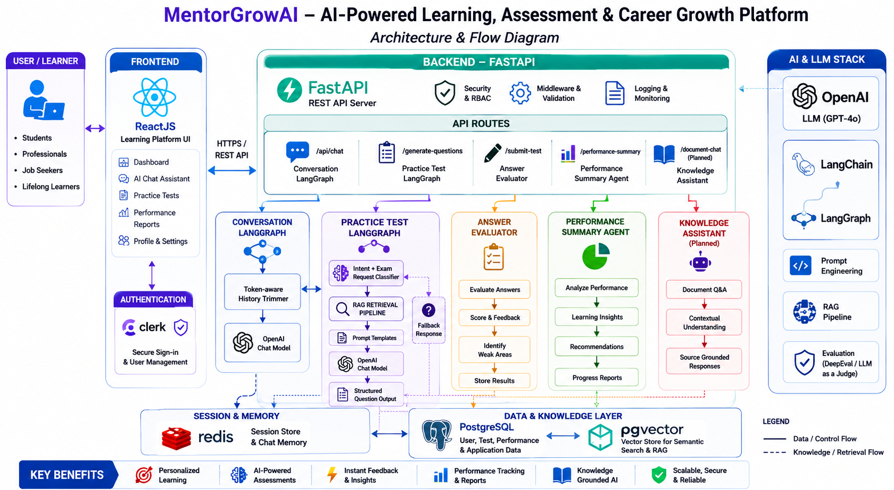
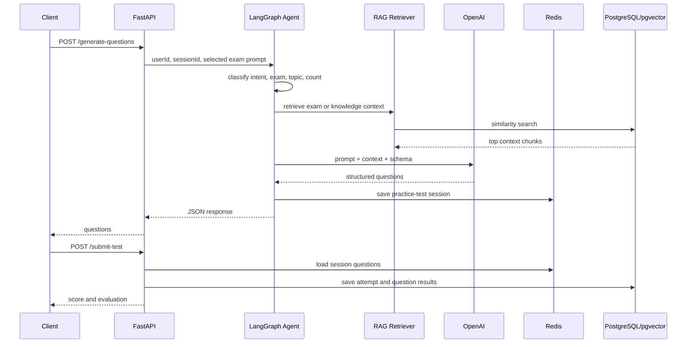

# MentorGrowAI 
**AI-Powered Learning & Evaluation Platform**

[](https://www.python.org/)
[](https://fastapi.tiangolo.com/)
[](https://www.langchain.com/)
[](https://www.langchain.com/langgraph)
[](https://github.com/pgvector/pgvector)
[](https://redis.io/)


**Website:** https://www.mentorgrowai.com/

MentorGrowAI is an agentic AI learning and practice-test platform for certification preparation, guided learning, knowledge-base assistance, and performance coaching. It combines FastAPI, LangGraph, OpenAI models, Redis session memory, PostgreSQL test history, and pgvector-powered RAG for exam and enterprise learning content.

The platform is designed to support multiple exam tracks such as AWS and NVIDIA certifications. The current backend includes an AWS AI Practitioner RAG seed, while the React UI already models a broader certification catalog with AWS AI Practitioner and NVIDIA Agentic AI options.

## Highlights

- Agentic question generation with LangGraph routing.
- Multi-certification practice-test experience for AWS, NVIDIA, and future exam tracks.
- RAG context retrieval from exam guides, policies, procedures, manuals, and domain documents.
- Structured LLM output for single-answer and multiple-response questions.
- Redis-backed chat and practice-test session memory.
- PostgreSQL persistence for attempts, answers, weak domains, and summaries.
- AI coach feedback with score tracking and weak-area identification.
- Docker Compose stack with FastAPI, Redis, and pgvector.
- React UI integration for dashboard, AI chat, certification selection, practice tests, results, and performance review.
- Optional Streamlit client for local backend testing.
- GitHub Actions workflow for backend Docker deployment to AWS ECR/EC2.

## Architecture

The diagram below shows MentorGrowAI as a learning, assessment, and career-growth platform. It captures the React learning UI, Clerk authentication, FastAPI backend routes, LangGraph-based agents, Redis session memory, PostgreSQL/pgvector data layer, and the AI/RAG stack.




## Request Flow



## Tech Stack

| Layer | Technology |
| --- | --- |
| API | FastAPI, Uvicorn, Pydantic |
| Agent Orchestration | LangGraph, LangChain |
| LLM | OpenAI chat models |
| Embeddings | OpenAI `text-embedding-3-small` |
| RAG Store | PostgreSQL with pgvector via `langchain-postgres` |
| Session Memory | Redis |
| Persistence | PostgreSQL tables for users, attempts, results, weak concepts, documents |
| Frontend | React, Vite, Clerk, React Router |
| Demo UI | Streamlit local client |
| Deployment | Docker, Docker Compose, GitHub Actions, AWS ECR/EC2 |

## Product Experience

The React UI in `MentorGrowAI_UI` presents MentorGrowAI as an end-to-end learning platform:

- Authenticated dashboard with learning-platform navigation.
- General AI chat for mentoring and learning support.
- Certification-specific practice-test selection.
- AWS and NVIDIA certification groups in the navigation model.
- Topic dropdowns that generate personalized practice tests.
- Single-answer and multiple-response question experience.
- Test result page after submission.
- Performance analytics with tests taken, average score, best score, latest score, weak areas, and AI coach feedback.
- Knowledge-base assistant flow for policies, procedures, manuals, and enterprise documents.

## Certification Coverage

The platform is built around a configurable certification catalog rather than a single exam. The React UI currently includes these tracks:

| Provider | Certification Track | Status |
| --- | --- | --- |
| AWS | AWS Certified AI Practitioner | Active UI option and current backend RAG seed |
| NVIDIA | NVIDIA Certified Professional: Agentic AI | Active UI option; backend content pipeline can be extended with NVIDIA guide material |
| AWS | AWS Machine Learning Engineer - Associate | Catalog model present for future activation |
| AWS | AWS Generative AI Developer - Professional | Catalog model present for future activation |
| NVIDIA | NVIDIA Certified Professional: Generative AI | Catalog model present for future activation |
| NVIDIA | NVIDIA Certified Associate: Generative AI LLMs | Catalog model present for future activation |

## Main API Endpoints

| Method | Endpoint | Purpose |
| --- | --- | --- |
| `GET` | `/health` | Backend health and version check |
| `POST` | `/api/chat` | General MentorGrowAI assistant chat with Redis memory |
| `POST` | `/generate-questions` | Generate certification practice questions from a user prompt |
| `POST` | `/submit-test` | Evaluate submitted answers and save the attempt |
| `POST` | `/performance-summary` | Generate user performance summary and weak-area feedback |

The React UI also references `/document-chat` for the knowledge assistant experience. That endpoint is represented in the frontend API config and can be wired to the existing RAG/document graph modules as the backend evolves.

## Repository Structure

```text
.
|-- rag/
|   |-- document_ingestion_pipeline.py
|   |-- document_retrieval_pipeline.py
|   |-- rag_config.py
|   `-- documents/
|-- server/
|   |-- agents/
|   |-- classifiers/
|   |-- database/
|   |-- evaluate/
|   |-- llms/
|   |-- memory/
|   |-- models/
|   |-- prompts/
|   `-- app.py
|-- docker-compose.yml
|-- Dockerfile
|-- mentorgrowai_create_tables.sql
`-- requirements.txt
```


## Example Requests

Generate questions:

```bash
curl -X POST http://localhost:8000/generate-questions \
  -H "Content-Type: application/json" \
  -d '{
    "userId": "demo_user@gmail.com",
    "sessionId": "session-001",
    "message": "Generate 10 practice questions for AWS AI Practitioner Domain 2"
  }'
```

Example prompts supported by the product direction include:

```text
Generate practice questions for AWS AI Practitioner Domain 2
Generate practice questions for AWS AI Practitioner Full Exam
Generate practice questions for NVIDIA-Certified Professional Agentic AI Agent Architecture and Design
Generate practice questions for NVIDIA-Certified Professional Agentic AI Full Exam
```

Submit a test:

```bash
curl -X POST http://localhost:8000/submit-test \
  -H "Content-Type: application/json" \
  -d '{
    "userId": "demo_user@gmail.com",
    "sessionId": "session-001",
    "answers": [
      {
        "questionId": 1,
        "selectedAnswers": ["A"]
      }
    ]
  }'
```

Get a performance summary:

```bash
curl -X POST http://localhost:8000/performance-summary \
  -H "Content-Type: application/json" \
  -d '{
    "userId": "demo_user@gmail.com"
  }'
```

## Deployment

The repository includes GitHub Actions workflows for containerized backend deployment:

- `.github/workflows/deploy.yml` builds and pushes the backend image to AWS ECR, then deploys it on EC2.
- `.github/workflows/deploy-dockerhub-backup.yml` provides a manual Docker Hub backup deployment path.

Required GitHub secrets include AWS credentials, EC2 host/user details, and the EC2 SSH key.

## Roadmap

- Add automated API and graph-flow tests.
- Add production-ready database migrations.
- Generalize backend exam configuration beyond the current AWS AI Practitioner seed.
- Wire the React knowledge-base assistant to the backend `/document-chat` flow.
- Enable streaming chat endpoint.
- Add ingestion pipelines for NVIDIA and additional certification guides.
- Expand document-grounded assistance across certification and enterprise knowledge domains.
